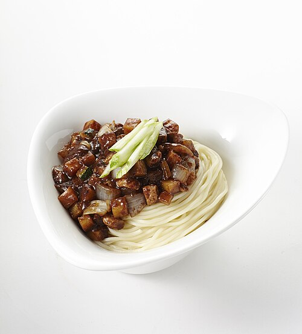

# 매운 짜장라면

> ⏱️ 조리시간: 12분 | 🍽️ 1인분 | 난이도: ⭐ 쉬움

## 📝 재료
- 라면 — 1봉지 (사리면 또는 일반 라면면)
- 짜장 소스 (시판 짜장 소스) — 3~4 큰술
- 고추장 — 1 큰술
- 청양고추 — 1~2개
- 대파 — 1/4대
- 식용유 — 1 큰술
- 물 — 500ml
- 간장 — 1/2 작은술
- 설탕 — 1/2 작은술

### 선택 재료 (있으면 더 맛있어요)
- 냉동 완두콩 또는 옥수수 — 2 큰술
- 달걀 — 1개
- 다진 마늘 — 1 작은술

## 👨‍🍳 만드는 법
1. 청양고추와 대파를 잘게 썰어두세요. 칼 하나만 쓰고 바로 냄비에 넣으면 도마도 금방 정리됩니다!
2. 냄비에 식용유를 두르고 중불로 달군 뒤, 청양고추와 대파를 1~2분간 볶아 향을 내세요.
3. 고추장 1 큰술을 넣고 30초 더 볶아 매콤한 기름을 만들어주세요.
4. 시판 짜장 소스 3~4 큰술을 넣고 30초 볶아 소스를 섞어주세요.
5. 물 500ml를 붓고 간장, 설탕을 넣어 센불로 끓여주세요.
6. 물이 팔팔 끓으면 라면 면을 넣고 3~4분간 끓이세요. 중간에 한 번 저어주세요.
7. 기호에 따라 달걀을 면 위에 깨뜨려 넣고 1분 더 끓이면 완성!

## 💡 꿀팁
- 시판 짜장 소스는 오뚜기 짜장, 해찬들 등 어떤 브랜드든 괜찮아요. 없으면 짜장라면 스프를 대신 사용하세요!
- 고추장 대신 청양고추를 넣으면 더욱 칼칼한 맛을 낼 수 있어요.
- 냄비 하나로 모든 걸 해결할 수 있어서 설거지가 최소화돼요. 달걀과 야채도 같은 냄비에 넣어버리세요!
- 라면 스프는 넣지 않아도 되지만, 짠맛이 부족하면 소금 약간으로 조절하세요.
- 면을 조금 덜 익혀두면 남은 열로 딱 알맞게 익어요. 국물이 너무 줄면 물을 조금 더 추가하세요.
